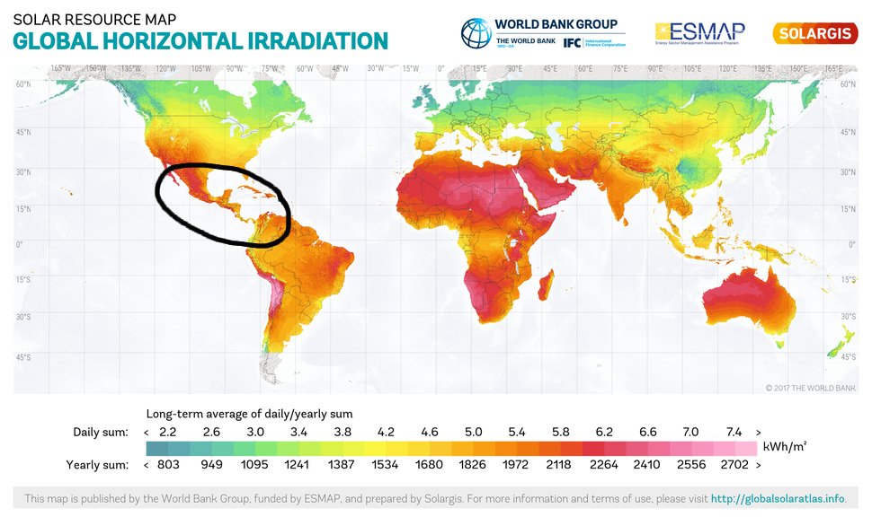

## Motivacija

- Praćenje promene nivoa solarne radijacije u toku godine i kreiranje pretpostavki za narednu godinu
- Računanje GHI(Global Horizontal Irradiance) na osnovu DNI(Direct Normal Irradiance), DHI(Diffuse Horizontal Irradiance) i upadnog ugla svetlosti

GHI = DHI + DNI · cos(θ)

## Problem

- BATCH OBRADA - Na osnovu poznatih podataka(2015-2017 godina) računaju se podaci za 2018 godinu koji su grupisani po mesecima u godini na odredjenoj teritoriji(prosek u toku meseca). Na osnovu promene između 2015, 2016 i 2017 godine pravi se pretpostavka za 2018 godinu
- STREAM OBRADA - Podaci koji stižu u realnom vremenu su podaci za 2018 godinu i na osnovu njih se proverava ispravnost pretpostavke

## Dataset

- NREL National Solar Radiation Database on AWS - [https://registry.opendata.aws/nrel-pds-nsrdb/](https://registry.opendata.aws/nrel-pds-nsrdb/)
- Preuzet pomoću web API-ja - [https://nsrdb.nrel.gov/data-sets/api-instructions.html](https://nsrdb.nrel.gov/data-sets/api-instructions.html)

## Oblast merenja radijacije



## Dataset - dobavljanje podataka

```py
for lat in range(0, 30, 1):
  for lon in range(-110, -70, 1):
    for year in range(2015, 2019, 1):
      df = pd.read_csv('http://developer.nrel.gov/api/solar/nsrdb_psm3_download.csv.....')
      df.to_csv('dataset/dataset_' + str(lat) + "_" + str(lon) + '_' + str(year) + '.csv', sep='\t')
```

## Primer
```py
 					Year	Month	Day	Hour	Minute	Temperature	DHI	DNI	SolarZenithAngle
2017-01-01 00:00:00	2017    1	    1	0	    0		24	        0	0	156.82
2017-01-01 10:30:00	2017    1	    1	10      30	    26	        417	374	29.74
2017-01-02 17:00:00	2017	1	    2	17	    0	    26	        33	0	78.86
```

## Hvala na pažnji

Pitanja?